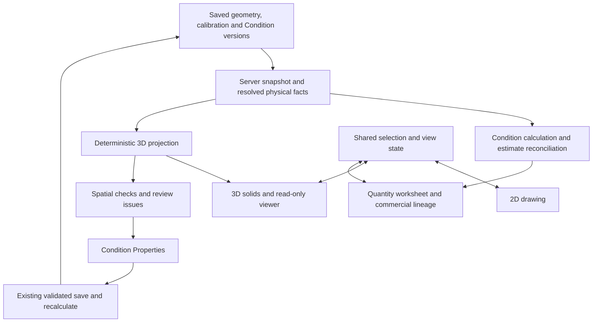

# Carez Takeoff — 3D verification architecture

Status: Accepted implementation direction, authorized by the user on 2026-09-05; extends ADR-013.  
Owner: 10 — Takeoff Workstation. Condition-domain coordination: 20 — Concrete Condition & Resource Engine.  
Implementation owner: existing Issue #41; no duplicate epic.  
Evidence checkpoint: staging commit `e42ce021061965d84030d9fa18ae83dde12caff8`, reviewed 2026-09-05.  
This document specifies the accepted target. The evidence/gaps table below records the pre-implementation checkpoint, not current behavior.

## Implementation checkpoint — 2026-09-05

Implemented in the accompanying source change:

- Authenticated, tenant/set-scoped server snapshot using the existing effective-input resolver; saved measurement/scale consistency holds.
- Separate projection contracts, coordinates, source resolution and spatial-check modules; read-only source quantity references and stable scoped identities.
- All primary assignments, validated slab holes, continuous anchored strip footprints, v2/v3 rectangular/trapezoid profiles, and pad placements.
- Explicit capability/input holds; saved versus unsaved preview; shape cache reuse and eviction.
- Shared selection and visibility between plan and model, guarded Condition switches, persistent sheet cameras, accessible face selection, collapsible issues, and renderer/projection failure isolation.
- Material-footprint intersection checks for supported constant-section geometry, with explicit incomplete status for tapered/complex candidates and bounded check work.

Remaining acceptance and follow-on scope:

- Live signed-in browser acceptance is pending; the staging browser currently reaches Vercel sign-in.
- Cross-sheet registration, governed steps/per-instance overrides, secondary physical systems, workers/GPU rendering and large-model performance acceptance remain future capabilities. Unsupported payloads are held; no dimensions are inferred.
- The SVG viewer remains a verification aid with painter-order depth handling. No exact solid-boolean or commercial reconciliation authority is added.
- No database schema, RLS, quantity writer, or production branch changes are included.

## 1. Decision

Extend the existing Takeoff workstation with a deterministic, read-only 3D verification layer. The same saved measurements, calibration, Concrete Condition inputs, and versions drive 2D, 3D, and the worksheet.

The server owns physical quantity calculation and commercial reconciliation. The renderer owns display, camera, picking, and visual filters. Solids are disposable representations of domain records.

Keep the existing modular application and Supabase/PostgreSQL authority. Start with a sheet-scoped model. Combining sheets into one building requires explicit spatial registration and a common elevation datum.

## 2. Architecture

The server snapshot and projection are modules inside the existing application, not new distributed services. A browser worker may build display buffers from resolved facts. It cannot write quantities, invoke privileged database access, or establish commercial truth.

## 3. Repository evidence and gaps

| Observed source | Present behavior | Required extension |
| --- | --- | --- |
| `lib/takeoff/conditions/derived3d.ts` | Deterministic boxes/prisms, primary-role lookup, elevation reference, copied source quantity, input issues, scene hash | Shared resolved dimensions; complete source revisions and roles; segment/instance metadata; precise validation; incremental per-object invalidation |
| `components/takeoff/TakeoffDerived3DView.tsx` | CPU projection into SVG, orbit/pan/zoom, sheet/zone filtering, local hide/isolate, clickable faces and issues | Shared visibility/selection; camera continuity; explicit display/error states; robust depth handling and performance validation |
| `IntegratedTakeoffConditionWorkspace.tsx` | Builds a scene in client `useMemo`; combines saved data with the selected draft; supplies scale-region calibration; coordinates view controls | Separate saved snapshot from draft preview; route every selection through one unsaved-change guard; capability checks per Condition version |
| `conditionEngine.server.ts` and `persistence.ts` | Existing server calculation boundary and input-resolution helper | Reuse these ownership boundaries for projection facts |
| `physicalGeometry.ts` | Existing 2D linear footprint supports center/left/right/custom anchors | Reuse or extract its governed footprint behavior with coverage before using it for 3D joins |
| `tests/derived-3d.test.ts` | Five test definitions cover deterministic derivation, pilot shapes, missing inputs and broad overlap/cutout warnings | End-to-end quantity reconciliation, calibration regions, topology, steps, revisions, selection and fallback fixtures |

Important evidence limits:

- The current renderer is SVG-based; it is not a WebGL renderer.
- The source gates 3D/Split when `stripModern` is selected. Do not remove that gate until the corresponding Condition schema has a supported and verified projection adapter.
- The current solid builder reads scalar `planFacts` and the primary role. It does not yet establish full repeated-module, secondary-role, step, or per-instance parity.
- Overlap warnings use axis-aligned bounds. They are candidate warnings, not proof of intersecting solids.
- Current cutout checking tests hole vertices against the outer polygon; it does not fully validate ring intersections and topology.
- A raw measurement quantity is copied onto every derived part. Those copies must never be summed. Two pads with a source count of two currently each carry that same source count.
- Existing fixtures do not prove geometric/quantity reconciliation: the slab fixture copies 720 SF although its illustrated outer area is 720 SF and its hole is 20 SF; the strip fixture copies 20 LF although its calibrated segments are 10 LF and 8 LF. This is a test-data limitation, not a demonstrated production quantity defect.
- No browser verification or test execution was performed for this architecture document.

## 4. Domain and scene contracts

### Authoritative snapshot

Resolve all inputs under the authenticated tenant and project/set scope. A snapshot must identify:

- company, project/job context and takeoff set;
- measurement ID and geometry revision or exact existing concurrency token;
- role assignment identity and role key;
- logical sheet and exact drawing revision;
- applicable sheet/region calibration and its version;
- Project Condition revision and Company Template/Platform Archetype versions;
- resolved dimensions, profile, elevation/reference and provenance;
- approved segment/instance overrides and subtractive role geometry;
- calculation revision, output references and readiness;
- confirmed spatial registration/datum when several sheets are combined.

Use existing database identities and version guards. The names above describe required information, not a claim that new database columns already exist.

### Derived object

Every displayed object needs:

| Field group | Purpose |
| --- | --- |
| Logical object key | Stable source identity across redraws; includes role and persistent part/instance identity where available |
| Source references | Measurement, Condition version, sheet revision, calibration, output references |
| Representation | Box, polygon prism, supported profile sweep, or explicit unsupported state |
| Spatial facts | Footprint, bottom/top elevation, local transform and bounds, with declared units |
| Geometry key | Includes all shape-driving versions/inputs and projection algorithm version |
| Presentation | Condition color, visibility, selection, zone/level and review state |
| Readiness | Ready, input required, unsupported, preview, stale or unavailable |

Keep quantity/output references separate from render parts. Production Quantity, installed/order quantity, Direct Cost and Sell remain distinct server outputs.

A solid may point to several outputs; several solids may point to one measurement. Neither relationship permits reaggregation by mesh count.

### Shared state

The workstation owns selected measurement/Condition/role, active sheet, view mode, visibility, isolation, filters and issue focus. Each renderer consumes that state and emits domain selection intents.

Keep per-sheet or per-registered-scene 2D and 3D camera state locally. Camera, clipping, section view and visibility changes do not change scope or quantities.

## 5. Coordinates, calibration and elevation

### Sheet-to-model conversion

1. Read saved normalized vector points from the existing geometry contract.
2. Recover stable unzoomed PDF coordinates using the saved page dimensions.
3. Apply the measurement's governed scale-region calibration or existing valid whole-sheet calibration.
4. Apply the declared local origin and orientation consistently.
5. Set vertical position from explicit elevation and reference.

Use feet for model coordinates and dimensions. Convert inch-based properties once at the resolved-facts boundary. Display architectural feet/inches through the existing formatter.

Document the existing renderer's convention: X/Z are plan axes and Y is vertical. The current builder maps page-down to positive Z. Preserve that mapping or introduce one explicit, tested conversion shared by rendering, picking and alignment. Screen zoom, pan and PDF render resolution never enter physical geometry.

Missing calibration or unresolved scale-region boundaries produce a projection issue. Do not average incompatible scales or borrow a neighboring region.

### Elevation reference

| Reference | Vertical extent for positive depth/thickness d at elevation E |
| --- | --- |
| Top | Bottom E − d; top E |
| Bottom | Bottom E; top E + d |
| Centerline | Bottom E − d/2; top E + d/2 |

Zero and negative elevations are valid when explicitly entered. Missing elevation is not zero. Slopes, steps, offsets and changing depths require explicit supported metadata.

Vertical datum identity is separate from the numeric elevation. A local project datum is valid, but sheets using different datums cannot be combined until their relationship is confirmed.

### Sheet registration

Calibration defines size; it does not establish a shared building origin or orientation.

Begin with independent sheet scenes. For a combined model, require a reviewed placement transform tied to the exact sheet revision: translation, rotation, datum relation and evidence/control points. Avoid arbitrary model rescaling after calibration.

Details, enlarged plans, alternate drawings and superseded sheets must not be automatically stacked into one building. Deduplicate scene source selection by authoritative identities; flag uncertain scope relationships for estimator review.

## 6. Concrete geometry adapters

| Family | Takeoff type | Required physical facts | Derived geometry |
| --- | --- | --- | --- |
| Slab on grade | Area | Outer boundary, holes, thickness, elevation/reference | Extruded polygon with valid through-cutouts |
| Strip/wall footing | Linear | Run, width, depth, anchor/offset, elevation/reference | Governed continuous footprint and extrusion/sweep |
| Pad footing | Count | Each location, length/width or supported profile, depth, orientation, elevation/reference | One solid per location using explicit instance overrides |
| Stepped footing | Segment treatment on linked run | Segment boundaries, profiles, elevations and transition meaning | Connected supported segments with explicit transitions |
| Walls/grade beams/piers | Matching family measurement logic | Published supported family contract and required dimensions | Later adapters following the same source contract |
| Openings/blockouts/thickened edges | Governed secondary role | Host link, geometry, vertical extent and module meaning | Subtraction or additional solid according to the role |

Adapter rules:

- Resolve physical dimensions from the same effective inputs used by Condition calculation. Never independently guess input precedence in the viewer.
- A thin pilot adapter cannot claim support for a newer Condition schema merely because the family name matches.
- Current per-segment strip boxes are an initial representation. Continuous corners, anchors, intersections and steps require governed joins. Reuse existing footprint logic only after confirming topology and semantic parity.
- Validate complete polygons and holes. Reject nonfinite points, self-intersections and invalid ring relationships explicitly; never silently drop bad vertices and present the altered shape as valid.
- Do not invent risers or concrete between separated stepped segments.
- If scope accounting intentionally sums separate runs while physical solids overlap at a junction, flag that relationship for review. Never change the estimating convention by unioning visible meshes.
- Unsupported parts remain traceable in the issue list and 2D. Show scene coverage so an incomplete model cannot appear fully checked.
- Reinforcing, vapor barrier, forms, chairs and embeds remain traceable module outputs. Detailed 3D resource visualization is later scope and requires sufficient explicit placement data.

## 7. Saved, draft and stale state

The accepted baseline is a saved, internally consistent snapshot.

A property edit may generate a preview through the same projection contract. Mark it **Unsaved preview**. The worksheet continues to follow the existing **Pending recalculation** semantics; preview solids cannot imply current calculated outputs.

Save & recalculate uses the existing authenticated validation, optimistic concurrency and atomic Condition/output/estimate path. Swap the viewer to the returned saved revision only after success. Reject late responses for obsolete scene requests.

On conflict, retain the draft for resolution and keep the saved revision clearly identified. Never stitch old geometry, new dimensions and unrelated output revisions into an apparently current scene.

3D clicks, issue jumps, 2D selection and worksheet navigation must pass through the same unsaved-change decision before any selected Condition or measurement changes. A cancelled switch must leave all panes on the original selection.

## 8. Verification checks

| Check | Evidence needed | Behavior |
| --- | --- | --- |
| Missing/invalid physical input | Typed field validation | Hold only the affected projection; link to the exact property |
| Duplicate placement | Coincident supported footprint and elevation plus source identities | Review warning; preserve both source records |
| Possible overlap | Bounds intersection | Candidate only |
| Confirmed geometric intersection | Narrow-phase supported footprint/solid intersection with holes and vertical intervals | Geometric evidence for review; not automatic duplicate scope |
| Gap/disconnection | Declared expected connection plus configured tolerance | Flag unexpected separation; nearby unrelated objects are not automatically connected |
| Floating/elevation mismatch | Confirmed level/datum or explicit support relationship | Show expected and observed relationship |
| Cutout conflict | Full outer/hole topology and host/vertical extent | Hold invalid projection or flag a valid but conflicting scope relationship |
| Step discontinuity | Governed adjacent segments and transition semantics | Jump to the affected segment |
| Revision change | Authorized old/new snapshots and alignment | Compare geometry; never overwrite historical commercial records |

Separate numeric robustness tolerances from estimator review tolerances. Record units and provenance; do not introduce hidden job tolerances.

Every issue includes source revision, affected IDs, classification, check version, observed evidence, and a direct resolution target. A zero issue count means only that enabled checks found no issues within supported, loaded scope.

Review acknowledgments are tied to the source/check version. Changed geometry invalidates stale acknowledgments. Durable acknowledgments, if introduced, use additive tenant-scoped records; transient checks need no new quantity tables.

## 9. Renderer, performance and fallback

Preserve a renderer-neutral scene contract. Retain the existing SVG implementation for the initial correctness slice.

SVG face sorting uses average face depth and omits bottom faces in the inspected code. Treat correct occlusion, sectioning and larger scenes as unresolved renderer requirements. Add a GPU renderer behind the same contract when representative correctness/performance evidence justifies it. Select and validate a library during that bounded implementation slice; no package is locked by this proposal.

Required renderer interface: set scene, resize, select, filter, set/get camera, focus source, report capability/error, dispose.

Performance design:

- Per-object geometry keys; separate material/selection changes from shape rebuilds.
- Include tenant and exact source scope in cache keys; purge protected caches on logout/company change.
- Incremental rebuilding for edited/deleted objects and affected neighboring checks.
- Spatial index for overlap candidates instead of unconditional all-pairs comparison.
- Optional worker for display tessellation and bounded diagnostic work.
- Ignore obsolete worker responses; dispose removed resources.
- Load supported visible sheet/zone/level scope and disclose incomplete coverage.
- Render on interaction/change when possible; avoid decorative continuous animation.

Acceptance evidence must record representative object/vertex counts, device/browser, load/update/interaction latency and memory behavior. Set release thresholds before implementing the performance slice rather than claiming unmeasured capability.

Distinct UI states: no measured geometry; no supported objects; missing inputs; partial model; building; current; unsaved preview; stale; renderer unavailable.

A renderer failure preserves 2D drawing, Condition editing, saved outputs and worksheet access. Renderer-specific capability loss, including future WebGL/context loss, never blocks authoritative estimating.

## 10. Implementation map

Proposed paths are internal planning targets; confirm local naming and dependencies before changes.

| Existing/proposed location | Responsibility |
| --- | --- |
| Existing `lib/takeoff/conditions/derived3d.ts` | Keep public facade; incrementally move detailed contracts/adapters behind it |
| Proposed `lib/takeoff/conditions/derived3d/contracts.ts` | Renderer-neutral snapshot, primitive, source reference and issue types |
| Proposed `lib/takeoff/conditions/derived3d/resolve.server.ts` | Authenticated snapshot preparation and shared effective physical facts |
| Proposed `lib/takeoff/conditions/derived3d/coordinates.ts` | Calibration, axes, elevation and reviewed registration |
| Proposed `lib/takeoff/conditions/derived3d/adapters.ts` | Version-aware pilot family adapters |
| Proposed `lib/takeoff/conditions/derived3d/checks.ts` | Topology and spatial review evidence |
| Existing `TakeoffDerived3DView.tsx` | Viewer/controller boundary and current SVG renderer |
| Existing `IntegratedTakeoffConditionWorkspace.tsx` | Shared state, dirty guard, view rail and saved/draft orchestration |
| Existing Condition server actions/persistence | Preserve validated saves, concurrency and atomic downstream lineage |
| Existing `tests/derived-3d.test.ts` plus focused fixtures | Correctness and reconciliation; no tests that merely repeat renderer implementation |

Do not add a microservice, independent mesh database, parallel pricing engine, or new global navigation system.

The latest ADR-020 fixed-width collapsible side panes and ADR-016 top menubar govern the workstation. Older passages describing dock drag-resizing or a permanent global left rail are superseded.

## 11. Delivery sequence and gates

1. **Resolved source contract:** saved snapshot, effective dimensions, role/version identity, supported-schema checks, no repeated source-quantity aggregation.
2. **Pilot geometry parity:** slab holes; footing anchors/joins; pad orientation/instances; explicit elevation and calibration cases. Keep unsupported schema gates.
3. **Synchronized review:** shared selection/visibility, unsaved guard, camera continuity, exact issue targets and partial/stale state.
4. **Spatial QA and registration:** narrow-phase overlap, declared connections, supported steps, reviewed cross-sheet alignment and revision comparison.
5. **Renderer/performance hardening:** representative benchmarks, resource lifecycle and failure recovery; GPU adapter if justified.
6. **Stable-staging acceptance:** relevant typecheck/domain tests/build; deploy to the one staging line; authenticated browser acceptance. Update CURRENT_STATE only with implemented/verified facts.

Issue #41 remains the delivery owner. This design does not reorder unrelated roadmap work or reopen previously accepted Takeoff UX issues.

## 12. Required acceptance fixtures

- Known calibrated slab area with a real cutout and exact net quantity from the server.
- Bent strip run with correct LF, footprint anchor and depth/elevation.
- Multiple pads: one measurement total, per-location solids, no duplicated worksheet/estimate quantities.
- Top/bottom/centerline references, zero and negative elevation, missing elevation, invalid/nonfinite inputs.
- Multiple scale regions and page rotation/orientation parity.
- Concave polygons, holes crossing boundaries, overlapping holes, rotated nonintersecting objects whose bounding boxes overlap.
- Explicit steps, unsupported transitions and declared connection gaps.
- Sheet registration absent/present; mixed revisions; incompatible datums.
- Save, dirty preview, cancel/switch, stale save, late worker result, undo/redo, delete, detach and reload.
- Stable IDs across equivalent redraws; version changes invalidate the correct objects.
- Tenant isolation for snapshot access and any new registration/review records.
- 2D/3D/Split display the same referenced server quantities for the same worksheet scope; visual hide/section never changes totals.
- Browser verification of selection, camera, issue navigation, accepted pane/worksheet layout and renderer failure recovery.

Automated checks and source inspection do not establish rendered acceptance.

## 13. Canonical references

- [Documentation entrypoint](https://github.com/seancolmes/carez-concrete-os/blob/staging/docs/README.md)
- [Architecture](https://github.com/seancolmes/carez-concrete-os/blob/staging/docs/ARCHITECTURE.md)
- [Takeoff module](https://github.com/seancolmes/carez-concrete-os/blob/staging/docs/modules/takeoff.md)
- [ADR-013: derived 2D/3D verification](https://github.com/seancolmes/carez-concrete-os/blob/staging/docs/decisions/ADR-013-derived-2d-3d-takeoff-verification.md)
- [ADR-020: integrated workstation](https://github.com/seancolmes/carez-concrete-os/blob/staging/docs/decisions/ADR-020-integrated-takeoff-workstation-and-precision-cursor.md)
- [Accepted detailed target](https://github.com/seancolmes/carez-concrete-os/blob/staging/docs/concrete-condition-3d-workstation-target.md)
- [Current state](https://github.com/seancolmes/carez-concrete-os/blob/staging/docs/CURRENT_STATE.md)
- [Roadmap](https://github.com/seancolmes/carez-concrete-os/blob/staging/docs/ROADMAP.md)
- [Branch/release model](https://github.com/seancolmes/carez-concrete-os/blob/staging/docs/BRANCH_AND_RELEASE_MODEL.md)
- [Issue #41](https://github.com/seancolmes/carez-concrete-os/issues/41)
- [Inspected projection source](https://github.com/seancolmes/carez-concrete-os/blob/e42ce021061965d84030d9fa18ae83dde12caff8/lib/takeoff/conditions/derived3d.ts)
- [Inspected renderer](https://github.com/seancolmes/carez-concrete-os/blob/e42ce021061965d84030d9fa18ae83dde12caff8/components/takeoff/TakeoffDerived3DView.tsx)
- [Inspected workstation integration](https://github.com/seancolmes/carez-concrete-os/blob/e42ce021061965d84030d9fa18ae83dde12caff8/components/takeoff/IntegratedTakeoffConditionWorkspace.tsx)
- [Inspected fixtures](https://github.com/seancolmes/carez-concrete-os/blob/e42ce021061965d84030d9fa18ae83dde12caff8/tests/derived-3d.test.ts)

Upon acceptance, promote the implementation contract into the canonical Takeoff/derived-3D documents and Issue #41. Extend ADR-013 only where a durable architectural decision changes; implementation state remains governed by CURRENT_STATE.

